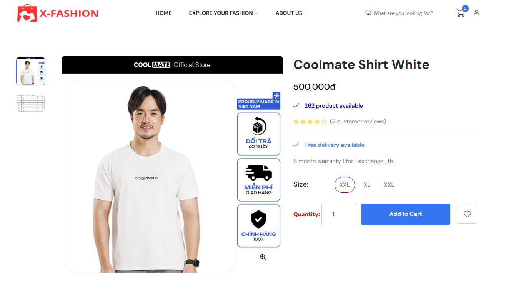
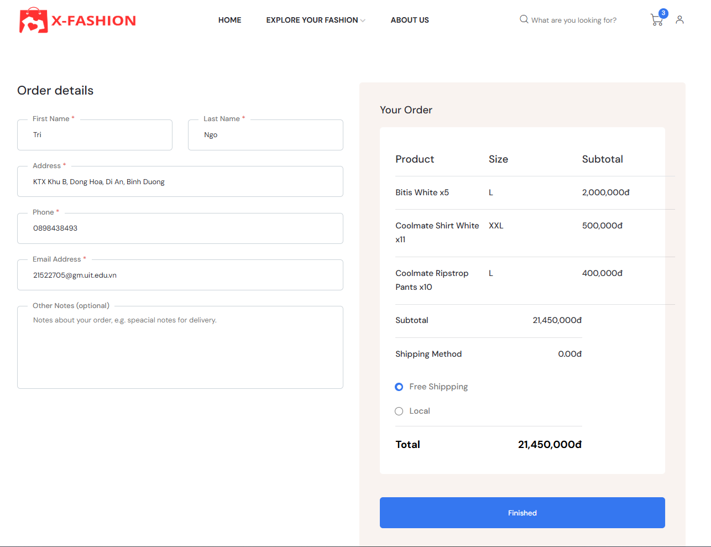
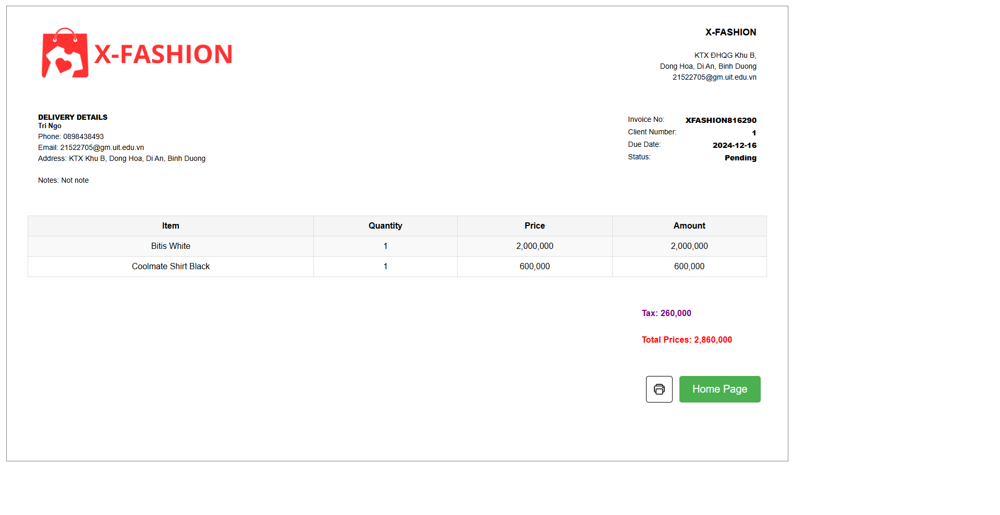
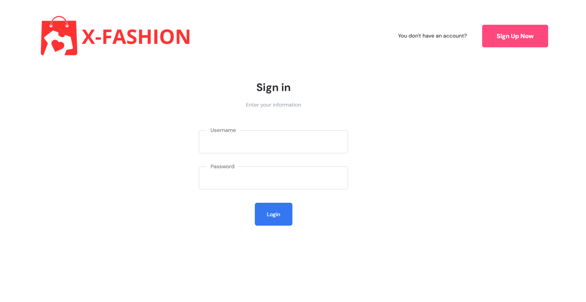
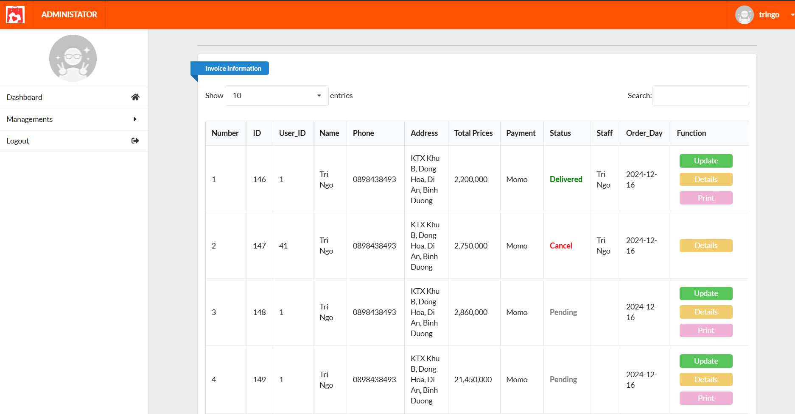
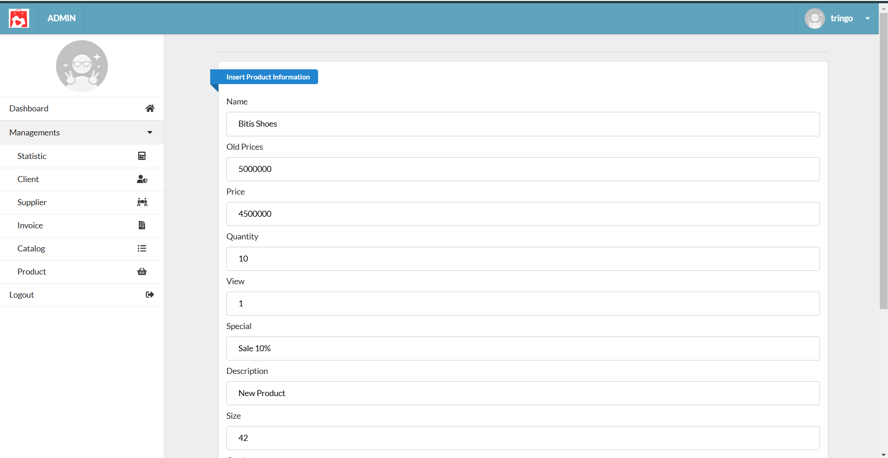
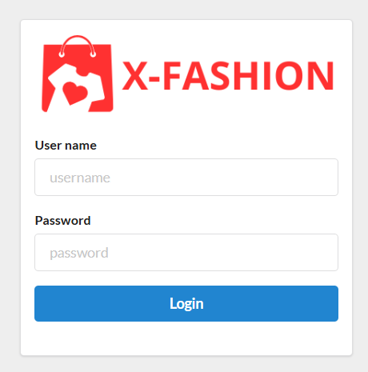

# Project: X-Fashion Website

>Tech stacks:
* Front-end: 
  - HTML, CSS, JS
* Back-end: 
  - PHP
* Database: 
  - MySQL

>How to run our project?
---------------------------------------------Start-----------------------------------------
1. Open visual studio code -> open terminal -> run this command-> git clone https://github.com/tringone/X-Fashion-Website.git (clone code)
2. Download Xampp.
3. Put the source code in the htdocs of the Xampp folder.
3. Run Xampp start Apache and MySQL.
4. Past "http://localhost/phpmyadmin/" in URL google.
5. Create database with name "fashion" in localhost phpmyadmin.
6. After that import database with data file in folder database.
7. Run code following links URL Example "http://localhost/X-Fashion/admin/admin.php"
8. Admin > Username: tringo Password: tringo "http://localhost/X-Fashion/admin/login.php"
9. User > Username: tringo Password: tringo "http://localhost/X-Fashion//web_user/login_user.php"
10. The above link is just an illustrative path, it may be different, Good Luck!
 
---------------------------------------------End-----------------------------------------

>Contact US

Gmail: 21522705@gm.uit.edu.vn

Phone: 0898438493

# MORE DETAILS ABOUT WEBSITE
**1. Home Page Website**

**2. Detail Product**

**3. Cart**

**4. Bill Information**

**5. Print Invoice**

**6. Login**

# MORE DETAILS ABOUT ADMIN

**1. Homepage**

**2. Insert Data**

**3. Login**

